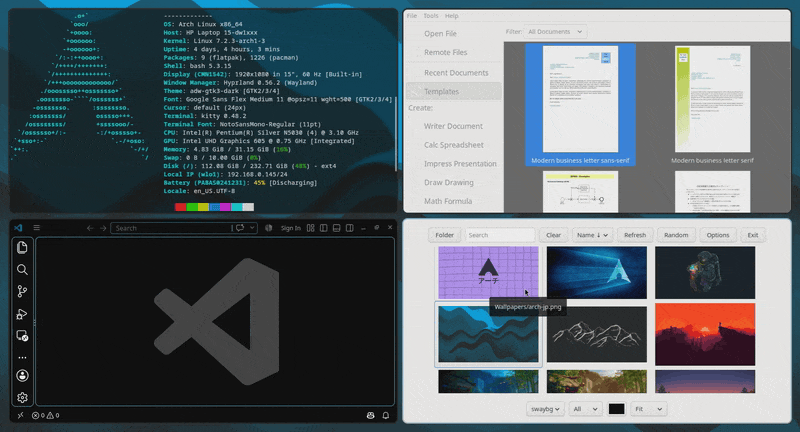

# hyprfling

Floating windows with momentum. Drag one and let go while it's still moving: it
keeps sliding, friction slows it down, it bounces off the screen edges, and it
knocks other floating windows out of the way. Turn on gravity and they fall.

**Fling mode** turns the whole screen into a toy: every window comes loose from
the layout right where it is, a plain click-drag throws it, and Esc puts
everything back in its tile.



Tested on Hyprland 0.56.2 with the Lua config (`hyprland.lua`, Hyprland 0.55+).
The older hyprlang config isn't supported.

## Install

You need Hyprland's headers (Arch's `hyprland` package ships them), a recent
GCC (the plugin is built with `-std=c++2c`), `pkg-config`, and the Lua 5.5
headers (`lua` on Arch).

```sh
git clone https://github.com/AustinGuidry/hyprfling ~/hyprfling
cd ~/hyprfling
make
```

Rebuild after every Hyprland update. Plugins share C++ objects with the
compositor, so a build made against other headers refuses to load and shows a
notification saying so. A new build takes effect the next time Hyprland starts.

## Config

In `hyprland.lua`:

```lua
hl.plugin.load(os.getenv("HOME") .. "/hyprfling/hyprfling.so")

-- Skipped on the first parse at startup, before the plugin has registered
-- these keys; the plugin's own reload applies them a moment later.
if hl.plugin.fling then
    hl.config({
        plugin = {
            fling = {
                friction  = 1.6,  -- how fast windows lose speed (1/s)
                bounce    = 0.7,  -- speed kept after hitting an edge or window (0-1)
                gravity   = 0,    -- downward pull (px/s^2); try 2500
                min_speed = 400,  -- slower releases just drop the window (px/s)
                max_speed = 6000, -- px/s
                collide   = true, -- flung windows knock other floating windows around
            },
        },
    })
end

-- Looked up at keypress, so a plugin that failed to load (say, after a
-- Hyprland update without a rebuild) doesn't turn these into Lua errors.
hl.bind(mainMod .. " + G", function()
    if hl.plugin.fling then hl.plugin.fling.mode() end
end)
hl.bind(mainMod .. " + Y", function()
    if hl.plugin.fling then hl.plugin.fling.yeet() end
end)
```

Outside fling mode, flinging uses your existing `hl.dsp.window.drag()` bind and
only floating windows fly.

A top-level `hl.plugin.load` is declarative: reloading the config doesn't load a
second copy.

## Fling mode

- **On:** every tiled window on a visible workspace floats in place. Windows
  that were already floating stay as they are. Fullscreen windows are left alone.
- **While it's on:** a plain left click on a window grabs it, and the app never
  sees the click. Let go mid-drag to throw it, or hold still first to just set it
  down. Clicks on bars and the empty desktop go through as usual, and your other
  keybinds keep working. Switching workspaces shakes loose the windows there too.
- **Off** (Esc, or the hotkey again): everything stops, and the windows fling
  mode floated go back into the layout. Windows that were floating before stay
  wherever they landed.

## Lua API

| Function                          | Does                                                                                        |
| --------------------------------- | ------------------------------------------------------------------------------------------- |
| `hl.plugin.fling.mode([on])`      | Toggle fling mode, or pass `true`/`false` to set it. Returns the new state.                 |
| `hl.plugin.fling.yeet([degrees])` | Throw the focused floating window. Random direction if omitted; `0` is right, `270` is up.  |
| `hl.plugin.fling.toggle()`        | Physics on/off. Returns the new state.                                                      |
| `hl.plugin.fling.stop()`          | Freeze everything mid-flight.                                                               |

From a terminal: `hyprctl eval 'hl.plugin.fling.yeet(270)'`. These are Lua
functions rather than dispatchers because `hyprctl dispatch` and `hl.dispatch`
only accept `hl.dsp.*` dispatchers under the Lua config.

## Hacking on it

Try new builds in a nested Hyprland so a crash only takes down that window:

```sh
Hyprland -c dev/nested.lua
export HYPRLAND_INSTANCE_SIGNATURE=...   # the new one, from `hyprctl instances`
make load                                # swaps in a fresh build; `make unload` removes it
```

`dev/nested.lua` binds drag, fling mode and yeet to ALT, because your real
session grabs SUPER + drag before the nested one sees it.

`make load` loads each build from a fresh copy under `$XDG_RUNTIME_DIR/hyprfling/`.
glibc can't unmap a library that has `STB_GNU_UNIQUE` symbols (every Hyprland
global is one), so unloading and reloading the same path silently re-runs the
old code. That's also why a rebuild only reaches your real session after a
restart.

Plugin log lines show up in `hyprctl rollinglog` once `debug.disable_logs` is
`false` (`dev/nested.lua` sets it).

## License

MIT — see [LICENSE](LICENSE).
